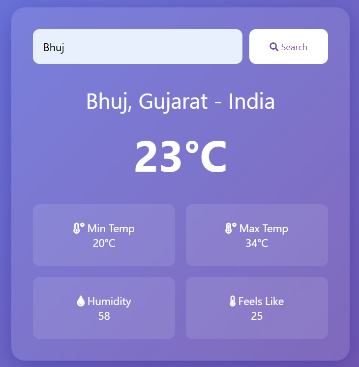

# Weather App

A simple weather application that fetches real-time weather data based on user input. This project is built using HTML, CSS, and JavaScript and utilizes a weather API to display weather conditions.

## Features

- Search for weather information by city name.
- Displays temperature, humidity, and weather conditions(min and max temperature).
- Simple and responsive user interface.
- Fetches real-time weather data using a public API.

## Technologies Used

- HTML
- CSS
- JavaScript
- API: https://wttr.in

## Installation & Usage

1. Clone this repository:
   ```bash
   git clone https://github.com/Shoyeb45/MiniProjects.git
   ```
2. Navigate to the Weather App folder:
   ```bash
   cd MiniProjects/Weather-App
   ```
3. Open `index.html` in your browser.

## Screenshots

<p>
    
    <p align="center">Interface of weather app</p>
</p>

## License

This project is open-source and available under the [MIT License](LICENSE).


